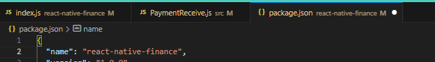

# Aplicativo de mobilidade - motorista

# Sumário

-   [Aplicativo de mobilidade - motorista](#aplicativo-de-mobilidade---motorista)
-   [Sumário](#sumário)
-   [Pré Requisitos](#pré-requisitos)
    -   [Ambiente](#ambiente)
        -   [Ubuntu](#ubuntu)
        -   [Node JS](#node-js)
        -   [Yarn e NPM](#yarn-e-npm)
        -   [Git](#git)
        -   [Android Studio](#android-studio)
        -   [Visual Studio Code](#visual-studio-code)
    -   [Instalação do projeto](#instalação-do-projeto)
        -   [Clone o projeto](#clone-o-projeto)
        -   [Configurando](#configurando)
    -   [ Rodando o projeto](#rodando-o-projeto)
    -   [ Usando lib local](#usando-lib-local)


# Pré-requisitos

Pré requisitos de ambiente e pacotes de software a serem instalados.

## Ambiente

### Ubuntu

```sh
lsb_release -a

No LSB modules are available.
Distributor ID:	Ubuntu
Description:	Ubuntu 20.04.5 LTS
Release:	20.04
Codename:	focal
```

### Node JS

```sh
curl -sL https://deb.nodesource.com/setup_16.x | sudo -E bash -

sudo apt-get install -y nodejs

node -v

v16.19.0
```

### Yarn e NPM

```sh
curl -sS https://dl.yarnpkg.com/debian/pubkey.gpg | sudo apt-key add -
echo "deb https://dl.yarnpkg.com/debian/ stable main" | sudo tee /etc/apt/sources.list.d/yarn.list

sudo apt update

sudo apt install yarn

yarn --version
1.22.19

npm --version
8.19.3
```

### Git

```sh
sudo apt update
sudo apt install git
```

### Android Studio

```sh
https://developer.android.com/studio?hl=pt-br
```

### Visual Studio Code

Recomendamos o uso do Visual stúdio code como IDE de desenvolvimento

```sh
sudo apt-get install snapd
snap install code --classic
```

## Instalação do projeto

### Clone o projeto

1. Com o git instalado e o terminal aberto, execute o comando abaixo, para clonar o repositório:

```
git clone https://git.codificar.com.br/mobilidade/provider.git

cd provider

git checkout deversion
```

### Configurando

1. Tenha instalado o Android Studio

2. Configure a variável de ambiente ANDROID_HOME corretamente

```sh
export ANDROID_HOME=~/Android/Sdk
export ANDROID_SDK_ROOT=~/Android/Sdk
export PATH="$PATH:$ANDROID_HOME/tools"
export PATH="$PATH:$ANDROID_HOME/platform-tools"
```

3. Instale o Java JDK 11

```sh
sudo apt-get install openjdk-11-jdk
```

4. Instale o React Native

```sh
npm install -g react-native-cli
```

5. Instale o jetifier

```sh
yarn add jetifier
```

## Rodando o projeto

Antes de começar essa etapa, garanta que todos os pré-requisitos foram cumpridos e que exista um aparelho em modo de desenvolvedor ligado conectado via usb ao computador ou inicie um emulador através do Android Studio.

1.  Clone o repositório com o comando:

```sh
git clone https://git.codificar.com.br/mobilidade/provider.git
```

2. Instale as dependências do node com a instrução abaixo:

```sh
yarn install
```

3. Execute o comando abaixo na pasta root do projeto para iniciar uma nova instância do metro.

```sh
yarn start
```

4. Por fim, rode a seguinte linha de código no terminal para buildar e instalar o aplicativo no aparelho conectado.

```sh
yarn android
```

## Usando lib local

1. Fazer clone da biblioteca que deseja usar na mesma pasta que seu projeto gomobi-driver.

2. No package.json do projeto do motorista, adicionar a dependencia apontando para o path da biblioteca da seguinte maneira:
```sh
    "react-native-finance": "file:C:/Users/310138068/Desktop/Galdino/Projetos/native/libs/react-native-finance",
```

3. Executar o script passando argumentos, criei uma ferramenta usando o nodemon como wacth para a pasta da biblioteca. Para que a cada alteração feita na biblioteca seja refletida na pasta node_modules do projeto (Hot reload) sem necessidades de symlinks visto que não funcionam para react-native. Existe na raiz do projeto motorista uma pasta chamada hotreload, é necessário fazer yarn install ou npm install dentro dela. Exemplo:
```sh
 cd hotreload 
 yarn install
```

4. Rodar sempre Dentro da pasta hotreload
```sh
 node hotreload react-native-finance (Nome da pasta da biblioteca) react-native-finance (Nome da dependencia conforme imagem abaixo)
```
  ''

5. Pronto, agora seu ambiente esta escutando todas as alterações sendo efetuadas na biblioteca local e refletindo direto na pasta da biblioteca instalada no seu projeto, sem necessiade de parar e iniciar seu emulador de volta.
